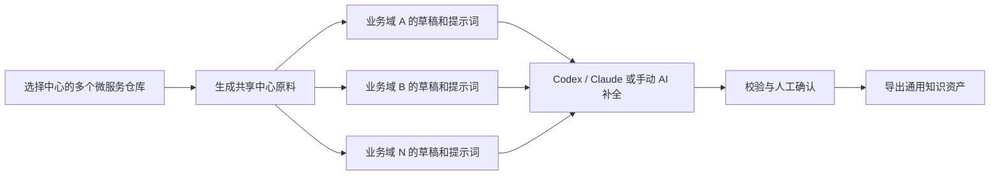
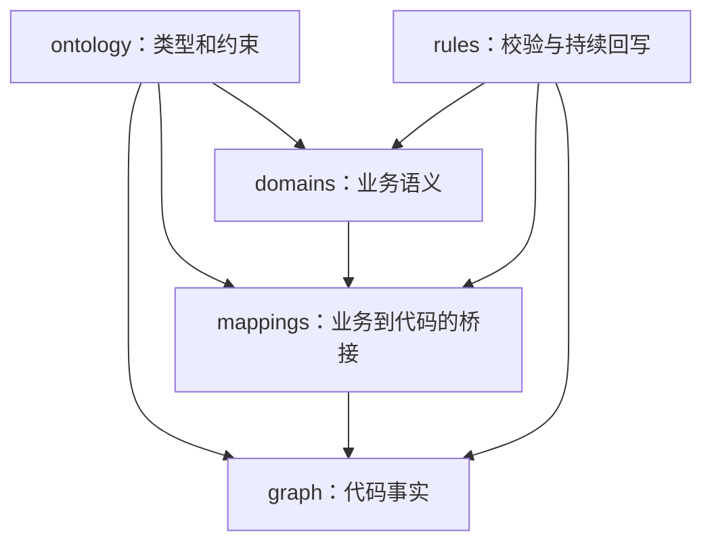

# Knowledge Builder

Knowledge Builder 是一个面向存量微服务的业务域知识库构建工具。它以业务域而不是单个项目为维护单元，聚合一个业务域涉及的多个代码仓库，生成产品、开发、测试共同使用的通用知识资产。生成结果是普通 Markdown/YAML，可导出到任意目录，再由 Git、文档站点或 RAG 平台消费。

> 同一产品或业务中心只需生成一次共享代码原料，即可创建多个业务域任务。页面可以显式调用本地 Codex 或 Claude Code 深读代码，并在校验和人工确认后导出；执行所需的任务提示词保存在运行目录中，不在页面展示。

## 适用场景

- 一个业务域横跨多个微服务，例如订单履约可能涉及 API 服务、核心服务、MQ 消费服务和外部系统。
- 希望把存量代码整理成产品口径、业务流程、规则、风险、代码调用链和数据关系。
- 希望 Agent 能从业务能力或规则，一步定位到 Controller、Service、Mapper、Table、MQ 和外部系统。
- 希望知识结论保留代码路径、行号、仓库 commit 和 `VERIFIED / UNVERIFIED` 状态。

Knowledge Builder 不负责自动发现企业全部业务域，也不会仅凭代码把推断直接标记为事实。业务域名称、边界和关联仓库需要由使用者明确提供。

## 当前能力

| 能力 | 状态 |
| --- | --- |
| 一个业务域聚合多个微服务仓库 | 已支持 |
| Word、PDF、Excel、PPT、HTML 资料转换 | 已支持，需要 MarkItDown |
| 多仓库代码上下文提取和 commit 记录 | 已支持，使用 Repomix |
| 同一业务中心原料复用于多个业务域 | 已支持 |
| 业务本体、代码图谱和映射骨架 | 已支持 |
| 面向 AI 的深读代码提示词 | 已支持 |
| 导出到通用知识库目录 | 已支持 |
| 检测并调用本地 Codex / Claude Code | 已支持，需用户显式启动 |
| 自动执行本体完整性校验 | 已支持 |

## 工作流程



中心原料和业务域任务分别保存：

```text
workspace/
├── materials/<product>/<material-id>/
│   ├── material.json     # 产品、仓库、commit 和上下文路径清单
│   ├── converted-docs/   # 共享的非代码资料转换结果
│   └── repomix/          # 共享的多仓库代码上下文
└── runs/<domain-run-id>/
    ├── drafts/           # 单个业务域的知识资产骨架
    │   ├── ontology/
    │   ├── domains/
    │   ├── graph/
    │   ├── mappings/
    │   ├── rules/
    │   └── AI_PROMPT.md
    └── README.md         # 记录本业务域引用的中心原料
```

业务域 run 不复制 Repomix 结果，只引用中心原料中的绝对路径。代码仓库 commit 发生变化时，应显式生成一份新原料；旧业务域任务仍保留原始 commit 的可追溯性。`AI_PROMPT.md` 不属于最终知识资产，导出时会自动跳过。

## 知识库结构

最终以产品和业务域组织：

```text
<output-dir>/code-knowledge/
└── <product>/
    └── <domain>/
        ├── ontology/
        │   ├── concept-types.yaml
        │   ├── node-types.yaml
        │   ├── relation-types.yaml
        │   └── schema.md
        ├── domains/<domain>/
        │   ├── overview.md
        │   ├── flows.md
        │   ├── pitfalls.md
        │   ├── glossary.yaml
        │   ├── concepts.yaml
        │   ├── capabilities.yaml
        │   └── rules.yaml
        ├── graph/curated/<domain>.graph.yaml
        ├── mappings/<domain>.mapping.yaml
        └── rules/
            ├── validation-rules.yaml
            └── sync-rules.md
```

知识资产分为四层：



- `ontology`：业务概念类型、代码节点类型、关系类型以及属性和端点约束。
- `domains`：业务边界、术语、概念、能力、规则、流程和经验风险。
- `graph/curated`：能够从源码复核的代码节点和关系。
- `mappings`：业务能力、业务规则到代码入口、表、MQ 和外部系统的映射。
- `rules`：知识完整性检查要求和代码变更后的持续回写要求。

## 本体模型

### 业务概念

`domains/<domain>/concepts.yaml` 使用 11 类业务概念：

| 类型 | 含义 |
| --- | --- |
| `domain_entity` | 有业务身份和生命周期的核心对象 |
| `relation_entity` | 可独立维护的对象间业务关系 |
| `state_entity` | 可判断、可迁移的业务状态 |
| `process_entity` | 由多个步骤组成的业务过程 |
| `process_state` | 异步流程、任务或审批的阶段状态 |
| `value_object` | 没有独立身份、由属性值定义的概念 |
| `business_identifier` | 稳定识别业务对象的编码或组合键 |
| `business_rule` | 被多个能力共享的规则性概念 |
| `async_artifact` | 消息、事件、任务记录或中转数据 |
| `config_entity` | 影响业务行为的开关、阈值或配置 |
| `external_system` | 业务语义层依赖或同步的外部平台 |

业务概念不是 Java 类。同一业务概念即使分布在多个服务中也只定义一次，服务分布由代码事实层和映射层表达。

### 代码节点和关系

代码事实层包含 `Service`、`Controller`、`ServiceClass`、`Repository`、`Mapper`、`Table`、`Entity`、`Convertor`、`Enum`、`FeignClient`、`MQTopic`、`Consumer`、`Job`、`Util`、`ExternalSystem` 和 `BusinessDomain`。

支持的关系包括：

```text
invokes      calls        feign_calls   reads       writes
references   converts     publishes     consumes    syncs_to
maps         belongs_to   triggers
```

关系定义包含允许的 `from/to` 节点类型；带 `path` 的节点应使用 `<仓库名>/<仓库内相对路径>`，避免跨服务同名类产生歧义。

### 业务到代码的关系

```text
业务概念
  -> 业务能力
  -> 业务规则
  -> capability_mappings / rule_mappings
  -> Controller / Service / Mapper / Table / MQ / ExternalSystem
```

每个能力至少应映射一个代码节点，每条 `high` 级别规则必须存在代码映射和证据。

## 快速开始

### 环境要求

- Node.js 18 或更高版本，推荐 Node.js 20+
- npm
- Git
- 可选：Python 3 和 [MarkItDown](https://github.com/microsoft/markitdown)，用于转换非代码资料
- 可选：本地安装并登录 Codex CLI 或 Claude Code，用于自动补全知识

安装项目：

```bash
git clone https://github.com/Gary-Coding/knowledge-builder.git
cd knowledge-builder
npm install
```

如需转换补充资料：

```bash
pip install markitdown
```

Repomix 由构建流程通过 `npx -y repomix` 调用，也可以提前验证：

```bash
npx -y repomix --version
```

### 页面模式

```bash
npm start
```

默认访问地址：<http://127.0.0.1:3187>。可以通过环境变量修改端口：

```bash
KB_PORT=3287 npm start
```

页面操作顺序：

1. 填写产品或业务中心，添加该中心的全部代码仓库和可选资料目录。
2. 点击“生成新原料”，等待 Repomix 完成；以后可以从下拉框直接选择它。
3. 填写业务域名称和边界，点击“生成骨架”。
4. 选择检测为“就绪”的 Codex 或 Claude 并显式点击“开始执行”；如需人工处理，可打开运行目录使用其中的任务文件。
5. 查看实时日志，执行完成后点击“校验产物”，再人工检查 `drafts` 中的知识资产。页面展示 AI 的阶段进度、工具调用和简短工作摘要，不输出模型的私有逐步思维链；Codex/Claude 的完整 stdout/stderr 会保存在运行目录的 `execution.log` 中。
6. 可选择通用知识库输出目录，点击“导出知识资产”；未选择时使用工作区默认目录。
7. 连续整理其他业务域时，只修改业务域名称和边界，不再运行 Repomix。

AI 执行不会自动导出。执行进程成功退出也不等于知识资产有效，必须通过 Markdown/YAML、本体关系和映射完整性校验，并由使用者确认后才能导出。

页面目录选择器当前仅支持 macOS。其他系统建议使用 CLI。

### CLI 模式

先为业务中心生成一次原料：

```bash
kb material \
  --product sample-center \
  --repo /path/to/sample-web \
  --repo /path/to/sample-core \
  --repo /path/to/sample-worker \
  --docs /path/to/supplementary-docs
```

命令会返回原料目录。随后可以基于同一目录生成任意数量的业务域任务：

```bash
kb domain \
  --material /path/to/knowledge-builder/workspace/materials/sample-center/<material-id> \
  --domain sample-domain-a \
  --scope "业务域 A 的范围和排除项" \
  --output /path/to/knowledge-assets

kb domain \
  --material /path/to/knowledge-builder/workspace/materials/sample-center/<material-id> \
  --domain sample-domain-b \
  --scope "业务域 B 的范围和排除项"
```

使用 CLI 前可执行 `npm link` 注册 `kb`。`--docs` 是可选参数。原有 `kb build` 命令仍保留，会一次性生成新原料和一个业务域任务，适合单次使用；连续整理同一中心时应使用 `material + domain`，避免重复运行 Repomix。

`--output` 是可选参数；不传时使用工作区默认知识库目录。可以通过 CLI 检测执行器并完成执行、校验和导出：

```bash
kb executors
kb execute --run /path/to/workspace/runs/<run-id> --executor codex
kb validate --run /path/to/workspace/runs/<run-id>
kb export --run /path/to/workspace/runs/<run-id> --output /path/to/knowledge-assets
```

`--executor` 可选 `codex` 或 `claude`。AI 执行不会自动导出；执行完成后仍须校验和人工确认。最终可通过页面或 CLI 导出 `ontology`、`domains`、`graph`、`mappings`、`rules`。

`--output-dir` 是 `--output` 的同义参数。页面和 API 统一使用 `outputRootDir` 和 `/api/runs/:runId/exports`。

建议从以下维度验收检索结果：

- 产品问题能否返回业务口径、能力和流程。
- 开发问题能否定位到服务、类、方法、表和消息。
- 测试问题能否返回业务规则、状态迁移、异常场景和回归点。
- 重要结论能否追溯到代码路径、行号和仓库 commit。

## 可信度和维护规则

- 代码可直接复核的内容进入 `graph/curated`。
- 业务口径和历史经验进入 `domains`。
- 业务到代码的定位关系进入 `mappings`。
- 未确认推断标记为 `UNVERIFIED`，不得伪装成代码事实。
- `meta.verified_commits` 逐仓记录验证版本；代码漂移后应重新核查。
- Controller、Feign、MQ、核心表、状态枚举、业务判定或外部同步发生变化时，应同步更新知识资产；如果下游使用检索平台，再按平台要求重建索引。

## 开发与测试

```bash
npm test
node --check server/index.js
node --check public/app.js
```

项目主要目录：

```text
bin/                         # 本地 kb 命令
public/                      # 本地页面
server/                      # 构建、执行、校验与导出服务
templates/project-context/   # 共享本体和规则模板
test/                        # Node.js 测试
workspace/runs/              # 本地构建产物，不提交 Git
workspace/materials/         # 可复用的中心原料，不提交 Git
```

## 当前边界与后续方向

当前版本有以下边界：

- 只调用本机已安装且已登录的 Codex CLI 或 Claude Code，不托管模型密钥。
- 不自动划分业务域，业务边界需要人工输入。
- AI 任务默认逐个执行，单任务超时上限为 120 分钟，支持取消和日志限制；不会使用跳过权限检查的参数。分析提示词采用“范围优先、证据扩展”策略，先闭环业务主链路，再按调用证据补读相关配置、SQL、消息和测试，避免无关模块拖慢任务。
- 导出后不会自动调用外部平台。
- 业务域运行状态会写入 `run.json`，但页面暂未提供完整历史列表。

优先的后续方向是：增加更多可选执行器与导出适配器、提供检索验收，以及支持增量代码变更驱动的知识回写。

## License

[ISC](package.json)
