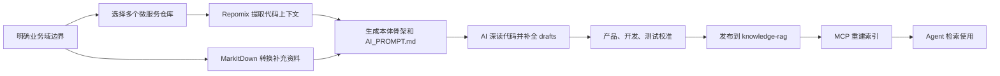
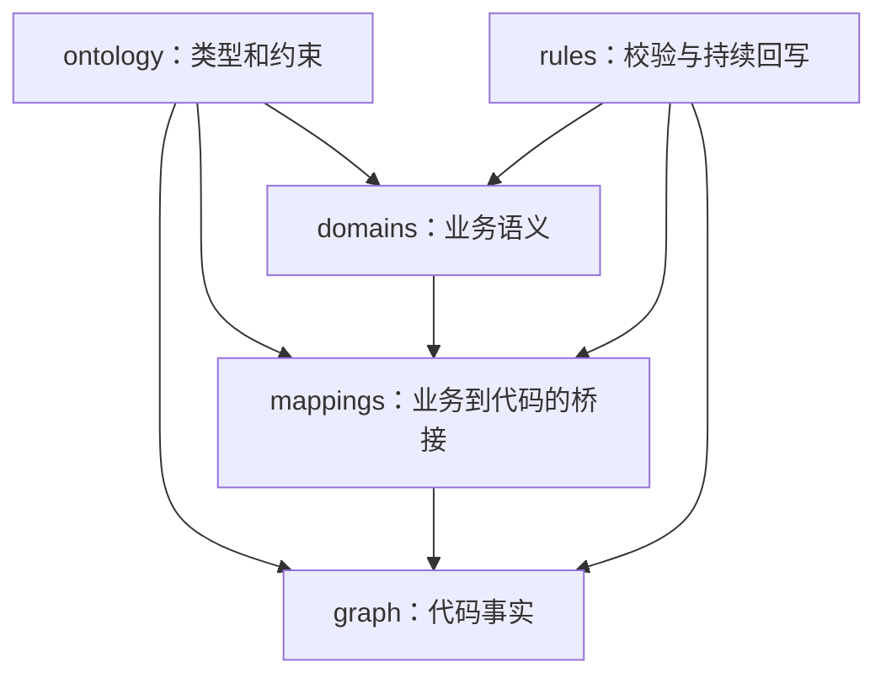

# Knowledge Builder

Knowledge Builder 是一个面向存量微服务的业务域知识库构建工具。它以业务域而不是单个项目为维护单元，聚合一个业务域涉及的多个代码仓库，生成产品、开发、测试共同使用的知识资产，并发布给 [knowledge-rag](https://github.com/lyonzin/knowledge-rag) 供 Agent 通过 MCP 检索。

> 当前版本是半自动工作流：工具负责资料转换、代码上下文提取、本体骨架、AI 任务提示词和发布；AI 深读代码、知识补全、人工校准以及 MCP 重建索引仍需显式执行。

## 适用场景

- 一个业务域横跨多个微服务，例如订单履约可能涉及 API 服务、核心服务、MQ 消费服务和外部系统。
- 希望把存量代码整理成产品口径、业务流程、规则、风险、代码调用链和数据关系。
- 希望 Agent 能从业务能力或规则，一步定位到 Controller、Service、Mapper、Table、MQ 和外部系统。
- 希望知识结论保留代码路径、行号、仓库 commit 和 `VERIFIED / UNVERIFIED` 状态。

Knowledge Builder 不负责自动发现企业全部业务域，也不会仅凭代码把推断直接标记为事实。业务域名称、边界和关联仓库需要由使用者明确提供。

## 当前能力

| 能力 | 状态 |
| --- | --- |
| 一个业务域聚合多个微服务仓库 | 已支持 |
| Word、PDF、Excel、PPT、HTML 资料转换 | 已支持，需要 MarkItDown |
| 多仓库代码上下文提取和 commit 记录 | 已支持，使用 Repomix |
| 业务本体、代码图谱和映射骨架 | 已支持 |
| 面向 AI 的深读代码提示词 | 已支持 |
| 发布到 knowledge-rag 文档目录 | 已支持 |
| 自动调用模型补全知识 | 未支持 |
| 自动执行本体完整性校验 | 未支持，当前提供声明式规则 |
| 自动调用 knowledge-rag MCP 重建索引 | 未支持 |

## 工作流程



一次构建会在 `workspace/runs/<run-id>/` 下生成：

```text
<run-id>/
├── converted-docs/       # 非代码资料转换结果
├── repomix/              # 每个仓库的代码上下文和仓库清单
├── drafts/               # 待 AI 补全和人工校准的知识资产
│   ├── ontology/
│   ├── domains/
│   ├── graph/
│   ├── mappings/
│   ├── rules/
│   └── AI_PROMPT.md
└── README.md             # 本次构建的路径和后续操作
```

`AI_PROMPT.md` 是构建任务说明，不属于最终知识资产，发布时会自动跳过。

## 知识库结构

最终以产品和业务域组织：

```text
knowledge-rag/documents/code-knowledge/
└── <product>/
    └── <domain>/
        ├── ontology/
        │   ├── concept-types.yaml
        │   ├── node-types.yaml
        │   ├── relation-types.yaml
        │   └── schema.md
        ├── domains/<domain>/
        │   ├── overview.md
        │   ├── flows.md
        │   ├── pitfalls.md
        │   ├── glossary.yaml
        │   ├── concepts.yaml
        │   ├── capabilities.yaml
        │   └── rules.yaml
        ├── graph/curated/<domain>.graph.yaml
        ├── mappings/<domain>.mapping.yaml
        └── rules/
            ├── validation-rules.yaml
            └── sync-rules.md
```

知识资产分为四层：



- `ontology`：业务概念类型、代码节点类型、关系类型以及属性和端点约束。
- `domains`：业务边界、术语、概念、能力、规则、流程和经验风险。
- `graph/curated`：能够从源码复核的代码节点和关系。
- `mappings`：业务能力、业务规则到代码入口、表、MQ 和外部系统的映射。
- `rules`：知识完整性检查要求和代码变更后的持续回写要求。

## 本体模型

### 业务概念

`domains/<domain>/concepts.yaml` 使用 11 类业务概念：

| 类型 | 含义 |
| --- | --- |
| `domain_entity` | 有业务身份和生命周期的核心对象 |
| `relation_entity` | 可独立维护的对象间业务关系 |
| `state_entity` | 可判断、可迁移的业务状态 |
| `process_entity` | 由多个步骤组成的业务过程 |
| `process_state` | 异步流程、任务或审批的阶段状态 |
| `value_object` | 没有独立身份、由属性值定义的概念 |
| `business_identifier` | 稳定识别业务对象的编码或组合键 |
| `business_rule` | 被多个能力共享的规则性概念 |
| `async_artifact` | 消息、事件、任务记录或中转数据 |
| `config_entity` | 影响业务行为的开关、阈值或配置 |
| `external_system` | 业务语义层依赖或同步的外部平台 |

业务概念不是 Java 类。同一业务概念即使分布在多个服务中也只定义一次，服务分布由代码事实层和映射层表达。

### 代码节点和关系

代码事实层包含 `Service`、`Controller`、`ServiceClass`、`Repository`、`Mapper`、`Table`、`Entity`、`Convertor`、`Enum`、`FeignClient`、`MQTopic`、`Consumer`、`Job`、`Util`、`ExternalSystem` 和 `BusinessDomain`。

支持的关系包括：

```text
invokes      calls        feign_calls   reads       writes
references   converts     publishes     consumes    syncs_to
maps         belongs_to   triggers
```

关系定义包含允许的 `from/to` 节点类型；带 `path` 的节点应使用 `<仓库名>/<仓库内相对路径>`，避免跨服务同名类产生歧义。

### 业务到代码的关系

```text
业务概念
  -> 业务能力
  -> 业务规则
  -> capability_mappings / rule_mappings
  -> Controller / Service / Mapper / Table / MQ / ExternalSystem
```

每个能力至少应映射一个代码节点，每条 `high` 级别规则必须存在代码映射和证据。

## 快速开始

### 环境要求

- Node.js 18 或更高版本，推荐 Node.js 20+
- npm
- Git
- 可选：Python 3 和 [MarkItDown](https://github.com/microsoft/markitdown)，用于转换非代码资料
- 一个可写的 knowledge-rag `documents` 目录

安装项目：

```bash
git clone https://github.com/Gary-Coding/knowledge-builder.git
cd knowledge-builder
npm install
```

如需转换补充资料：

```bash
pip install markitdown
```

Repomix 由构建流程通过 `npx -y repomix` 调用，也可以提前验证：

```bash
npx -y repomix --version
```

### 页面模式

```bash
npm start
```

默认访问地址：<http://127.0.0.1:3187>。可以通过环境变量修改端口：

```bash
KB_PORT=3287 npm start
```

页面操作顺序：

1. 选择 knowledge-rag 的 `documents` 目录。
2. 填写产品或业务中心、业务域名称和边界。
3. 添加该业务域涉及的所有代码仓库。
4. 按需选择补充资料目录。
5. 点击“生成原料”，等待 Repomix 完成。
6. 读取 `AI_PROMPT.md`，交给能够访问本地构建目录的 AI 执行。
7. 校准 `drafts` 中的知识资产后点击“发布入库”。

页面目录选择器当前仅支持 macOS。其他系统建议使用 CLI。

### CLI 模式

下面以一个通用的示例业务域为例：

```bash
node server/index.js build \
  --product sample-center \
  --domain sample-domain \
  --scope "本次需要整理的业务范围以及明确排除的相邻范围" \
  --repo /path/to/sample-web \
  --repo /path/to/sample-core \
  --repo /path/to/sample-worker \
  --docs /path/to/supplementary-docs \
  --knowledge-rag-docs /path/to/knowledge-rag/documents
```

`--docs` 是可选参数。也可以注册本地命令：

```bash
npm link
kb build --product sample-center --domain sample-domain \
  --repo /path/to/sample-core \
  --knowledge-rag-docs /path/to/knowledge-rag/documents
```

CLI 当前负责生成原料，不会自动发布。根据命令输出打开 `drafts` 和 `AI_PROMPT.md`，完成 AI 补全与人工校准后，可通过页面发布或将以下目录复制到目标业务域：`ontology`、`domains`、`graph`、`mappings`、`rules`。

## 接入 knowledge-rag MCP

确保 knowledge-rag 的 `documents_dir` 指向发布目录的上级 `documents`，并启用 `.md`、`.yaml`、`.yml` 文件索引。发布完成后，在已连接 knowledge-rag MCP 的 Agent 中执行：

```text
reindex_documents(force=true)
```

随后可以使用：

```text
search_knowledge(query="订单取消会更新哪些表")
search_knowledge(query="履约状态变更涉及哪些服务和 MQ")
get_document(...)
```

建议从以下维度验收检索结果：

- 产品问题能否返回业务口径、能力和流程。
- 开发问题能否定位到服务、类、方法、表和消息。
- 测试问题能否返回业务规则、状态迁移、异常场景和回归点。
- 重要结论能否追溯到代码路径、行号和仓库 commit。

## 可信度和维护规则

- 代码可直接复核的内容进入 `graph/curated`。
- 业务口径和历史经验进入 `domains`。
- 业务到代码的定位关系进入 `mappings`。
- 未确认推断标记为 `UNVERIFIED`，不得伪装成代码事实。
- `meta.verified_commits` 逐仓记录验证版本；代码漂移后应重新核查。
- Controller、Feign、MQ、核心表、状态枚举、业务判定或外部同步发生变化时，应同步更新知识资产并重建索引。

## 开发与测试

```bash
npm test
node --check server/index.js
node --check public/app.js
```

项目主要目录：

```text
bin/                         # 本地 kb 命令
public/                      # 本地页面
server/                      # 构建与发布服务
templates/project-context/   # 共享本体和规则模板
test/                        # Node.js 测试
workspace/runs/              # 本地构建产物，不提交 Git
```

## 当前边界与后续方向

当前版本有以下边界：

- 不直接调用模型，避免绑定模型供应商和密钥。
- 不自动划分业务域，业务边界需要人工输入。
- 校验规则尚未接入可执行校验器。
- 发布后不会自动调用 knowledge-rag MCP。
- 页面不持久化本地路径和构建历史。

优先的后续方向是：接入可选 AI 执行器、实现本体校验器、发布后自动重建索引并执行检索验收，以及提供增量代码变更驱动的知识回写。

## License

[ISC](package.json)
